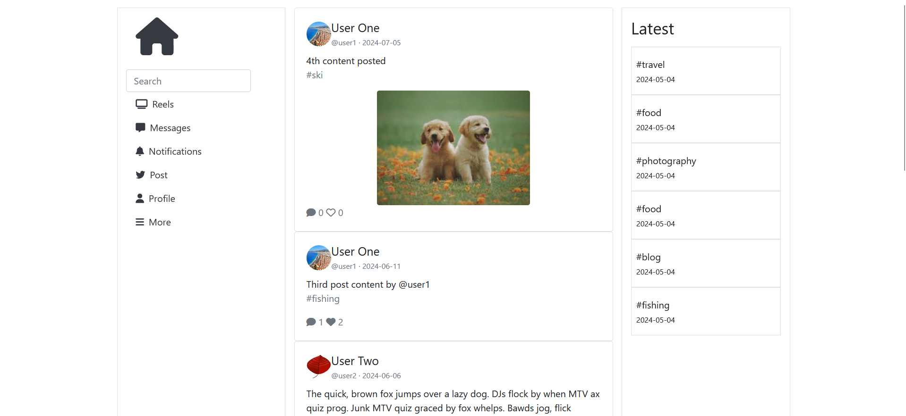

# Introduction

social media website based on twitter

(old project from when i just started learning)

## pictures

### main page



### profile page


### post tweet page


## getting started

1. clone the project
2. create a virtual enviroment
  ```
  python -m venv venv
  ```
  ```
  venv\Scripts\activate
  ```
4. pip install requirements.txt
   
5. to run the app type:
```bash
flask run
```
6. to log in use
   - username: @user1
   - password: password1
    
